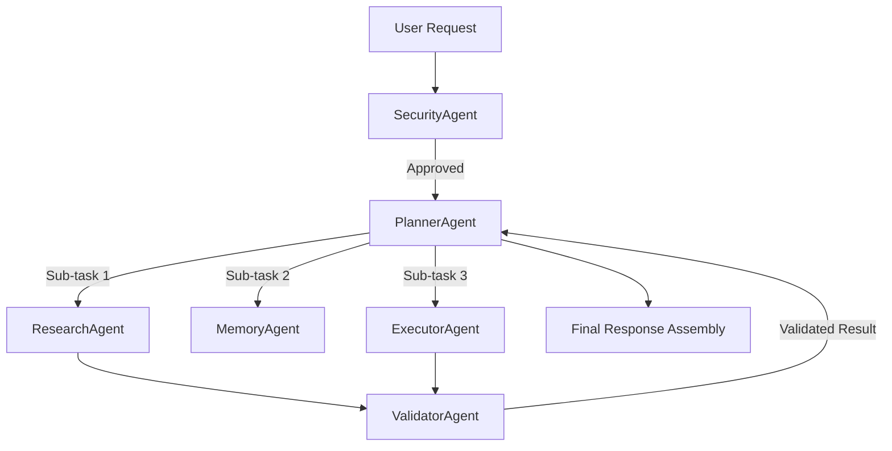

# KALKI AI — Multi-Agent Protocol Specification (MCP & A2A)

## Overview
KALKI AI employs a multi-agent framework built on two foundational standards:
1. **MCP (Model Context Protocol)**: Standardized host-client context and tool execution interface.
2. **A2A (Agent-to-Agent Protocol)**: High-performance asynchronous RPC for inter-agent collaboration.

---

## 1. Model Context Protocol (MCP) Integration

MCP provides a secure barrier separating language model reasoning from underlying host tools, APIs, and file systems.

### MCP Message Payload Standard (JSON-RPC 2.0)

```json
{
  "jsonrpc": "2.0",
  "id": "mcp-req-8842",
  "method": "tools/call",
  "params": {
    "name": "kalki_vector_search",
    "arguments": {
      "query": "quantum encryption standards",
      "top_k": 5,
      "min_confidence": 0.82
    }
  }
}
```

### Response Schema

```json
{
  "jsonrpc": "2.0",
  "id": "mcp-req-8842",
  "result": {
    "content": [
      {
        "type": "text",
        "text": "Extracted 3 relevant passages from enterprise security standard doc."
      }
    ],
    "isError": false
  }
}
```

---

## 2. Agent-to-Agent (A2A) IPC Protocol

The A2A protocol governs asynchronous delegation between specialized agent personas.

### Agent Personas & Hierarchy



### Specialized Roles & Responsibilities

| Agent Persona | Role Description | Communication Channel |
|---|---|---|
| **Planner Agent** | Decomposes goals into Directed Acyclic Graphs (DAGs); manages state transitions. | A2A Bus (`kalki.agents.planner`) |
| **Research Agent** | Queries external web APIs, document stores, and RAG hybrid search engines. | A2A Bus (`kalki.agents.research`) |
| **Memory Agent** | Manages short-term, long-term, semantic, and episodic memory persistence. | A2A Bus (`kalki.agents.memory`) |
| **Executor Agent** | Runs MCP tools, API calls, and sandboxed code execution tasks. | A2A Bus (`kalki.agents.executor`) |
| **Validator Agent** | Runs hallucination checks, schema assertions, and factual groundings. | A2A Bus (`kalki.agents.validator`) |
| **Security Agent** | Monitors execution traces for prompt injection, privilege escalation, and unsafe commands. | A2A Bus (`kalki.agents.security`) |

---

## 3. A2A Message Frame (Protobuf / JSON)

```json
{
  "trace_id": "tr-908124a-771c",
  "parent_agent": "PlannerAgent",
  "target_agent": "ResearchAgent",
  "message_type": "DELEGATE_SUBTASK",
  "payload": {
    "subtask_id": "st-001",
    "instruction": "Fetch market trend data for AI chips from internal RAG database",
    "required_context": {
      "filters": { "year": 2026 }
    },
    "timeout_ms": 3000
  },
  "timestamp_utc": "2026-07-21T20:39:00Z"
}
```
