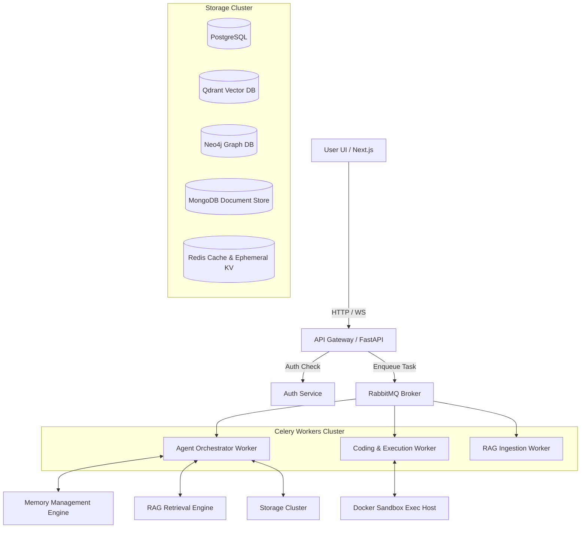

# KALKI AI (v2.0) — Technical Architecture Blueprint

This document details the architectural design for **KALKI** (**Krishna Autonomous Learning & Knowledge Intelligence**), a production-grade Autonomous AI Operating System.

---

## 1. Domain-Driven Design (DDD) & Clean Architecture

KALKI follows Clean Architecture principles, enforcing strict dependency flows where details depend on policies, and inner circles (core business logic) know nothing about outer circles (frameworks, databases, web servers).

```
          +-------------------------------------------------+
          |  4. INFRASTRUCTURE LAYER                         |
          |  PostgreSQL, Qdrant, Redis, WebServers, Docker  |
          +-------------------------------------------------+
                                  |
                                  v
          +-------------------------------------------------+
          |  3. INTERFACE LAYER (API, Controllers, WS)      |
          +-------------------------------------------------+
                                  |
                                  v
          +-------------------------------------------------+
          |  2. APPLICATION LAYER (Use Cases, Agent Services)|
          +-------------------------------------------------+
                                  |
                                  v
          +-------------------------------------------------+
          |  1. DOMAIN LAYER (Entities, Value Objects)      |
          +-------------------------------------------------+
```

### Domain Layer (Core Business Rules)
- **Entities**: `User`, `Agent`, `Memory`, `Task`, `Workflow`, `Document`, `AuditLog`.
- **Value Objects**: `PromptTemplate`, `EmbeddingVector`, `TokenUsage`, `SecurityContext`.
- **Aggregates**: `AgentExecutionSession`, `RAGContextBlock`.

### Application Layer (Use Cases)
- Orchestration interfaces: `IAgentExecutor`, `IMemoryConsolidator`, `IRetrievalPipeline`.
- Commands and Queries: `DispatchTaskCommand`, `RetrieveKnowledgeQuery`, `ExecuteToolAction`.

### Interface Layer (Adapters)
- HTTP REST API Controllers, WebSockets Gateways, GraphQL Schema, and CLI entrypoints.

### Infrastructure Layer (External Tools & DBs)
- Databases (Qdrant Client, SQLAlchemy Repositories, Neo4j Graph Driver).
- Message Brokers (Celery Workers, RabbitMQ Exchanges, Redis Pub/Sub).
- Model APIs (OpenAI, Anthropic, Gemini, local Ollama connectors).

---

## 2. Microservice Topology

KALKI is designed to scale horizontally across distributed node clusters:



---

## 3. High-Fidelity Model Abstraction Layer

To ensure models can be swapped dynamically at runtime without modifying application or domain logic, KALKI employs the **Gateway/Adapter Pattern**:

```
+--------------------------+
|     Application Code     |
+--------------------------+
             |
             v
+--------------------------+
|    ILLMProvider (Interface) |
+--------------------------+
             |
   +---------+---------+
   |                   |
   v                   v
+---------------+   +------------------+
| OpenAIAdapter |   | AnthropicAdapter | ... (Gemini, Ollama, DeepSeek)
+---------------+   +------------------+
```

### Dynamic Inference Request Configuration
Every query payload specifies model configuration parameters dynamically:
```json
{
  "provider": "anthropic",
  "model_name": "claude-3-5-sonnet",
  "temperature": 0.2,
  "max_tokens": 4096,
  "fallback_chain": ["openai/gpt-4o", "ollama/llama3.1-local"]
}
```

---

## 4. Multi-Agent Orchestration & Communication Bus

KALKI integrates **LangGraph** state machines for planning and **CrewAI/AutoGen** styles for hierarchical orchestration:

- **LangGraph Router**: Drives the cycle of planning, execution, validator-feedback loop, and reflection.
- **Model Context Protocol (MCP)**: Establishes a standard client-server protocol over JSON-RPC to invoke tools locally or remotely in safe execution contexts.
- **A2A Bus**: Coordinates inter-agent event-driven messaging utilizing Redis Pub/Sub.

---

## 5. Hierarchical Memory Pipeline

Memory processes follow a multi-stage consolidation pipeline:

```
[User Input] --> Short-Term Memory (Redis Session Cache)
                   |
                   v (Consolidation Pipeline - Async Task)
                 Episodic Memory (PostgreSQL task history)
                   |
                   v (Embedding & Semantic Triples Extraction)
                 Semantic Memory (Qdrant Vector DB & Neo4j Graphs)
```

---

## 6. Multi-Stage Ingestion RAG Pipeline

1. **Ingestion**: Upload file (PDF, Office, Media) -> OCR/Speech Recognition -> Markdown Normalization.
2. **Chunking**: Dynamic semantic chunking with metadata inheritance (parent/child documents).
3. **Index**: Embed chunks with BGE/OpenAI model -> Store in Qdrant Vector store.
4. **Graph Build**: Extract entities and relations -> Insert triples in Neo4j Graph DB.
5. **Retrieval**: Dense Vector Cosine + BM25 keyword matching -> Reciprocal Rank Fusion (RRF) -> Cross-Encoder Re-Ranking -> Graph Node context expansion -> Context-fused prompt generation.

---

## 7. Sandbox Execution & Defensive Security Boundaries

- **Python Runtime Execution**: Code generated by the Coding Agent is executed in transient, isolated Docker containers or Wasm sandboxes.
- **Prompt Injection Defense**: Dual-pass checks run prompts against static injection vectors and LLM Guard classifiers.
- **Malicious File Ingestion Scan**: Ingested files pass through static signature checkers (ClamAV API) before indexing or processing.
