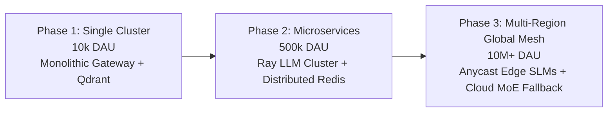

# KALKI AI — Business Model, Cost Estimation & Scalability Plan

## 1. Cloud Infrastructure Cost Estimation (Monthly Projections)

| Component | Resource Specification | Unit Cost | Projected Monthly Cost (100k Users) |
|---|---|---|---|
| **GPU Inference Cluster** | 8x NVIDIA H100 SXM (vLLM Engine) | $3.50 / GPU-hr | $20,160 |
| **Vector Storage (Qdrant)** | 3-Node Cluster (128GB RAM, SSD) | Managed Cloud | $1,200 |
| **Relational Database** | AWS Aurora PostgreSQL (Multi-AZ) | db.r6g.2xlarge | $1,450 |
| **Caching & Pub/Sub** | Redis Enterprise Cluster | 32 GB RAM | $450 |
| **Object Storage** | AWS S3 (Document storage & backups) | 10 TB | $230 |
| **Total Estimated Infrastructure Cost** | | | **~$23,490 / month** |

---

## 2. Horizontal Scalability Roadmap

---

## 3. Risk Assessment & Mitigation Matrix

| Risk Factor | Severity | Probability | Mitigation Strategy |
|---|---|---|---|
| **Prompt Injection Attack** | High | Medium | Dual-pass Security Agent verification using Llama-Guard 3 + static input sanitization. |
| **Hallucination in RAG Outputs** | High | Medium | Validator Agent verification threshold ($>0.85$ grounded confidence rating) before sending output. |
| **GPU Capacity Exhaustion** | Medium | High | Automatic graceful degradation to quantized local Edge SLMs or speculative decoding. |
| **Privacy Data Leakage** | High | Low | Dynamic PII anonymization regex layer on all document ingestion pipelines. |
