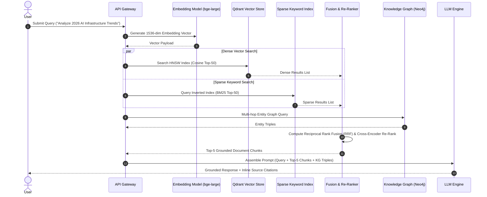

# KALKI AI — Retrieval-Augmented Generation (RAG) Architecture

## 1. End-to-End Pipeline Workflow

---

## 2. Mathematical Formalization of Hybrid Retrieval

### Reciprocal Rank Fusion (RRF)
Given a set of rank lists $M$ (Dense Vector and BM25 Sparse), the RRF score for document $d$ is:

$$RRF\_Score(d \in D) = \sum_{m \in M} \frac{1}{k + r_m(d)}$$

Where:
- $k$ is a smoothing constant (typically set to $60$).
- $r_m(d)$ is the rank position of document $d$ in retrieval list $m$.

### Re-Ranking Stage
The top candidate documents from RRF are passed through a Cross-Encoder model ($CE$) to evaluate query-document relevance:

$$Score_{re-rank}(Q, D_i) = \text{CrossEncoder}(Q \oplus D_i)$$

The highest-scoring $N=5$ document chunks form the contextual memory window provided to the LLM.

---

## 3. Document Ingestion & Chunking Specification
- **Chunk Size**: 512 tokens with 64-token sliding overlap.
- **Preprocessing**: Semantic section boundary splitting, table extraction via Markdown conversion.
- **Deduplication**: MinHash LSH (Locality-Sensitive Hashing) threshold $0.92$.
